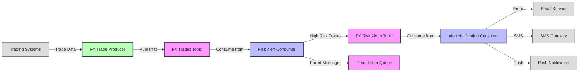

# FX Risk Monitoring System Architecture

## System Overview
A high-level overview of the system's purpose and approach to solving the FX risk monitoring problem.

## Architectural Diagram

## Core Components

### 1. Message Flow
Detailed explanation of how data moves through the system:
- Trade data generation/ingestion
- Kafka topics as communication channels
- Consumer group partitioning

### 2. Risk Assessment Engine
How trades are analyzed for risk:
- Risk scoring algorithm
- Threshold determination
- Alert generation logic

### 3. Notification System
How alerts are processed and distributed:
- Virtual threads implementation
- In-flight notification tracking
- Multiple notification channels

### 4. Error Handling & Resilience
How the system maintains reliability:
- Dead Letter Queue (DLQ) implementation
- Retry strategies
- Failure recovery processes

## Design Patterns & Best Practices
Notable patterns implemented in the system:
- Producer-Consumer pattern with Kafka
- Exactly-once processing semantics (or at-least-once with idempotency)
- Virtual thread per task executor for IO-bound operations

## Performance Considerations
How the system is optimized for:
- High throughput
- Low latency
- Resource efficiency through virtual threads

## Deployment Scenarios
Different ways to deploy and scale the system:
- Development environment setup
- Production deployment recommendations
- Scaling strategies

## Future Enhancements
Potential improvements and extensions:
- Additional risk metrics
- Integration with other systems
- Performance optimizations